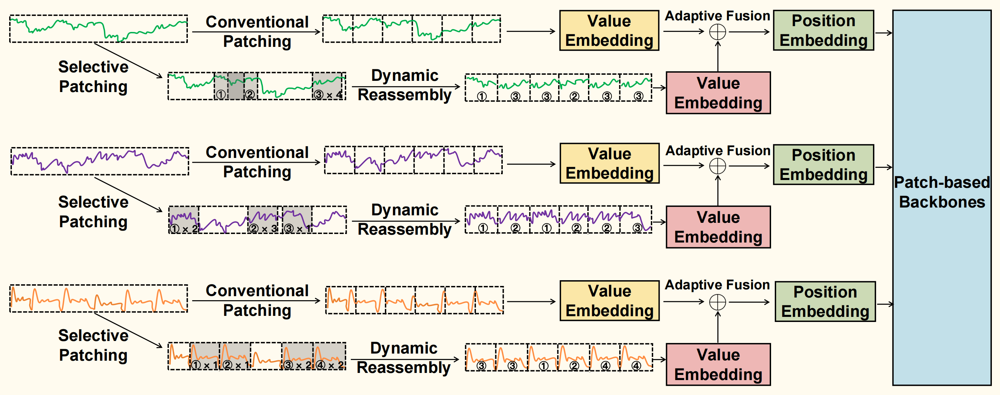
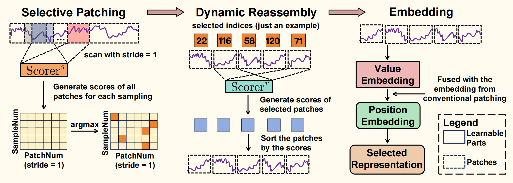
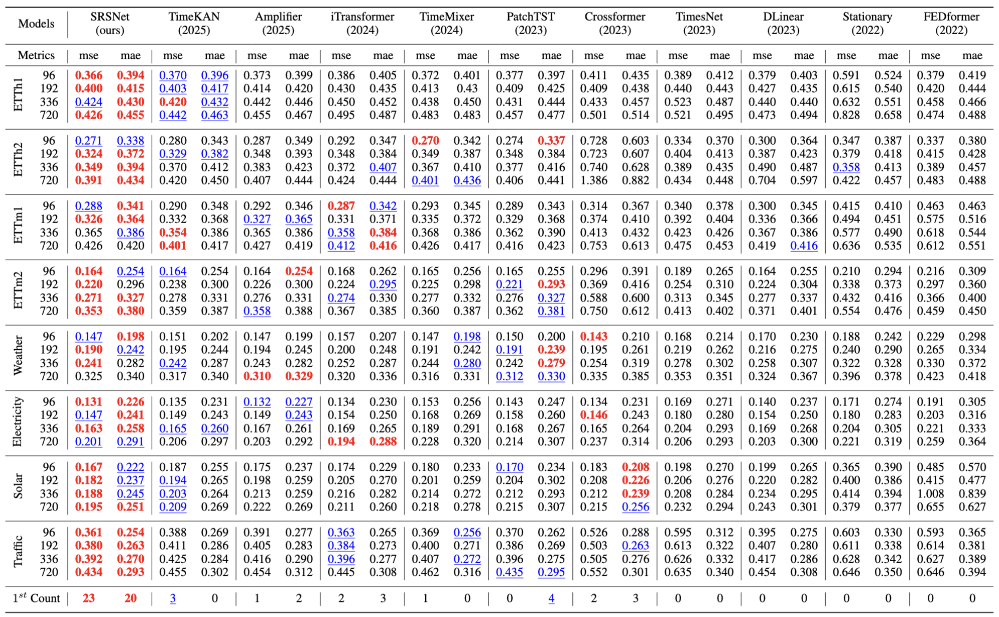

# Enhancing Time Series Forecasting through Selective Representation Space: A Patch Perspective 


This code is the official PyTorch implementation of paper: Enhancing Time Series Forecasting through Selective Representation Space: A Patch Perspective 


## Introduction

In this paper, we pioneer the exploration of consctructing a selective represenation space to flexibly include the information beneficial for forecasting. Specifically, we propose the **Selective Representation Space (SRS)** module, which utilizes the learnable Selective Patching and Dynamic Reassembly techniques to adaptively select and shuffle the patches from the contextual time series, aiming at fully exploiting the information of contextual time series to enhance the forecasting performance of patch-based models. To demonstrate the effectiveness of SRS module, we propose a simple yet effective **SRSNet** consisting of SRS and an MLP head, which achieves state-of-the-art performance on real-world datasets from multiple domains. 

<div align="center">

</div>

The important components of the **SRS** Module: (1) Selective Patching; (2) Dynamic Reassembly ; (3) Adaptive Fusion
<div align="center">

</div>


## Quickstart

> [!IMPORTANT]
> this project is fully tested under python 3.8, it is recommended that you set the Python version to 3.8.
1. Requirements

Given a python environment (**note**: this project is fully tested under python 3.8), install the dependencies with the following command:

```shell
pip install -r requirements.txt
```

2. Data preparation

You can obtained the well pre-processed datasets from [Google Drive](https://drive.google.com/file/d/1vgpOmAygokoUt235piWKUjfwao6KwLv7/view?usp=drive_link). Then place the downloaded data under the folder `./dataset`. 

3. Train and evaluate model

- To see the model structure of **SRSNet**,  [click here](./ts_benchmark/baselines/srsnet/models/srsnet_model.py).
- We provide all the experiment scripts for SRSNet and other baselines under the folder `./scripts/multivariate_forecast`.  For example you can reproduce all the experiment results as the following script:

```shell
sh ./scripts/multivariate_forecast/ETTh1_script/SRSNet.sh
```


## Results
Extensive experiments on  8 real-world datasets demonstrate that SRSNet achieves state-of-the-art~(SOTA) performance.

<div align="center">

</div>
